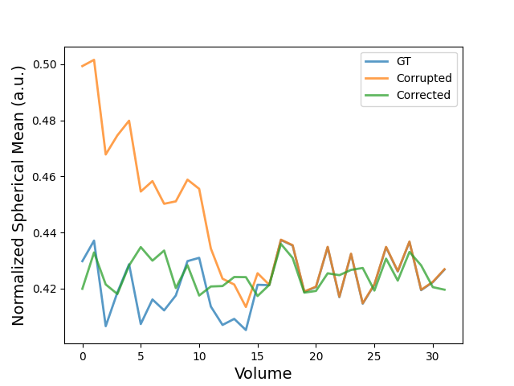
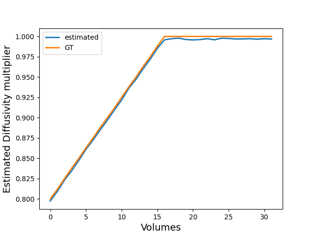
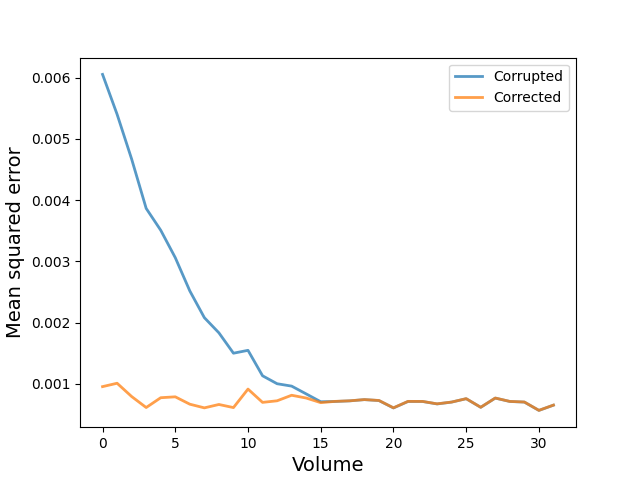

# Correcting temperature related diffusivity drift for postmortem difusion MRI
## Michael Paquette, Cornelius Eichner, Christian Bock, and Alfred Anwander
### ISMRM2024, Program 2423

This repo contains a short example of the presented method using in-vivo data with artificial diffusivity corruption.  
The dataset was created from a single b=1000 shell from subject PT001_ses-1_acq-1 from the [Pentera 3T public dataset](https://zenodo.org/records/2602049)  


The Ground truth data (1 b0 + 32 b1000) was corrupted to simulate temperature induced diffusitity drift ([see ground truth alphas](corrupted_data/coef_alpha.txt)).  

We use the b0 and last 16 volumes ([see index file](corrupted_data/index.txt)) to estimate the steady-state diffusivities.  

```bash
dti_temp_correction.py corrupted_data/corrupted.nii.gz \
                       data/bval.txt \
                       data/bvec.txt \
                       corrupted_data/index.txt \
                       corrected_data/corrected.nii.gz \
                       corrected_data/estimated_coef.txt \
                       corrected_data/signal_multipliers.nii.gz \
                       --mask data/mask.nii.gz
```
We output 
- The corrected data; corrected_data/corrected.nii.gz
- The estimated volume-wise alpha coefficients; corrected_data/estimated_coef.txt
- The voxel-wise signal multipliers; corrected_data/signal_multipliers.nii.gz


## Spherical means of normalized signal


## Estimated alpha coefficients


## MSE of the signals w.r.t. ground truth



We note that the correction in this example is "noisy", it only uses 16 volumes for the estimation and the "temperature" effects are large.  
We also note that we are not fixing the alpha coefficient to 1 for the subset of volumes used in the estimation.  
